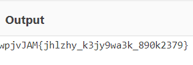

# Description
Can you get the real meaning from this file.

# Walkthrough
Download and open the file. We get the following:

YidkM0JxZGtwQlRYdHFhR3g2YUhsZmF6TnFlVGwzWVROclh6ZzVNR3N5TXpjNWZRPT0nCg==

Now this looks like a base64 encryption so lets use cyberchef.

When we input this and the cyberchef recipe we get:

This still looks base64 encoded. However, we need to remove the 'b'' to get the recipe to work. 

