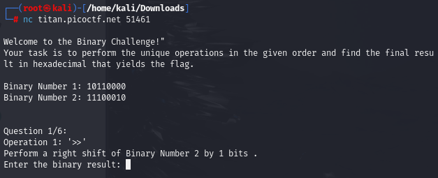
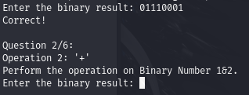
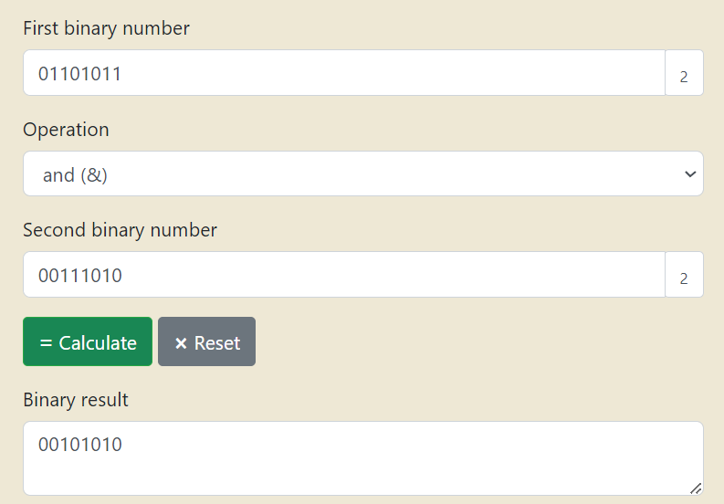
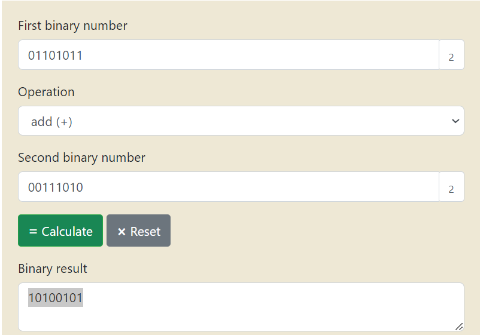
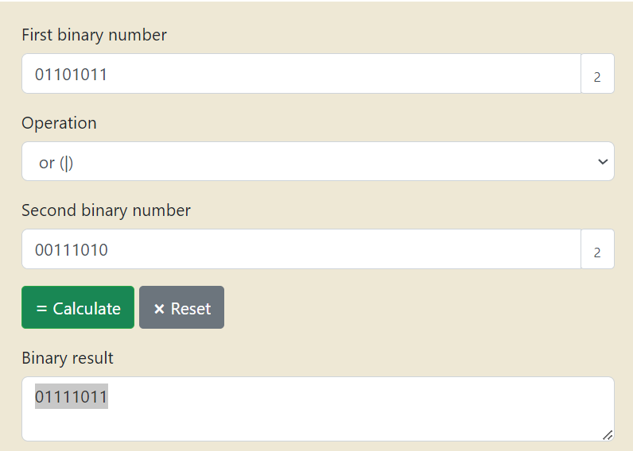
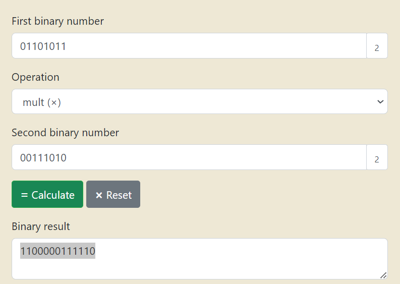
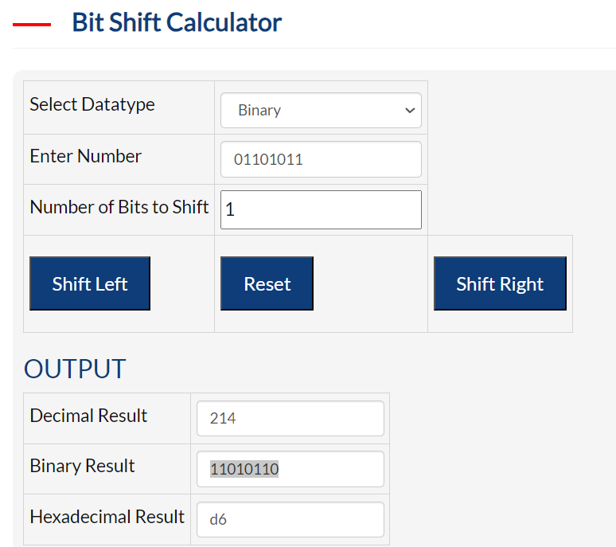
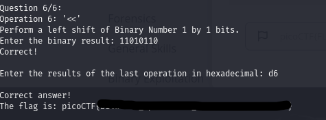

# Description
How well can you perfom basic binary operations?

## Walkthrough
connect to the host using netcat.

To solve the binary challenge, we need to go through the operations step by step. We first need to perform a right shift operation on the given binary numbers.

Q1 - >>
For the operation >>, we will perform a right shift on Binary Number 2 by 1 bit.
Shifting to the right by 1 bit means moving each bit one position to the right. The leftmost bit (most significant bit) will be filled with 0.

  11100010  (Original)
→ 01110001  (Right shift by 1)

Enter this into the CLI to move onto the next question

Q2 - &
Use a binary Calculater for this one!

Q3 - +

Q4 - |

Q5 - *

Q6 - <<

We are then prompted to enter the last answer in hexadecial to obtain the flag.

