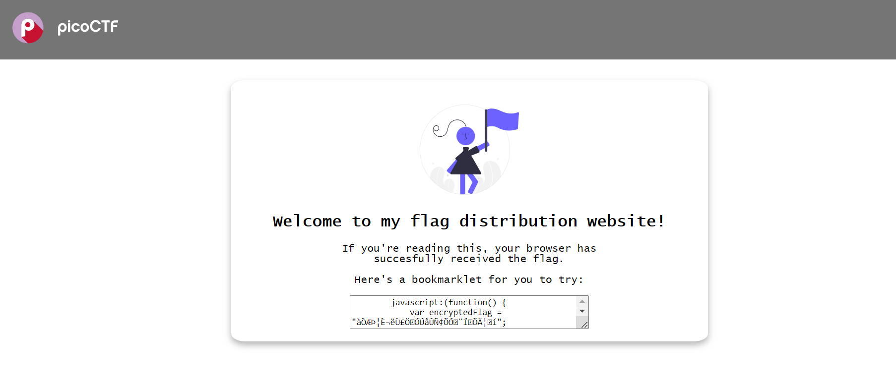
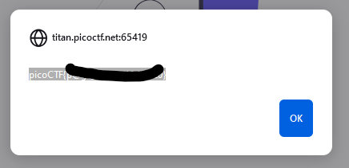
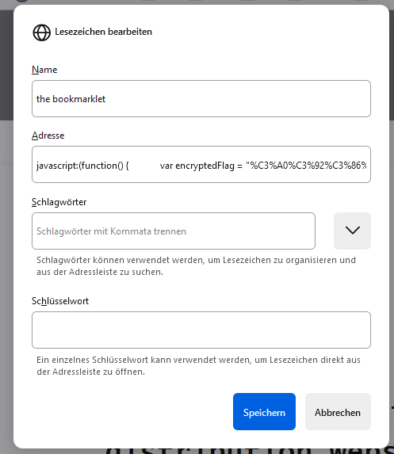
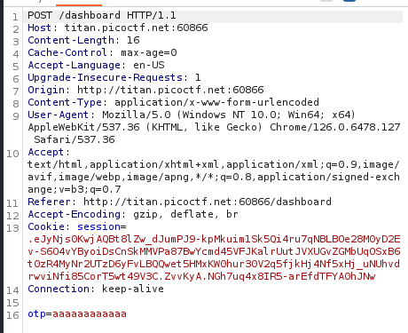
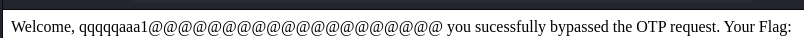

# Description
Try here to find the flag

## Walkthrough
When we go to the link provided it shows us this screen:

Lets open up burpsuite. Start a new project and open the url on the brup browser. Lets start to intercept requests by entering some data into the user entry form.

Keep selecting the 'forward' button on burp to bypass authenication. We will get the 2FA authentication page.

Again, input some data and intercept the request. 

At the bottom we can see *otp=123*, which typically refers to a one-time password. Highlight this line, romove it and click the 'apply' button on burp then forward again to get the flag. 

